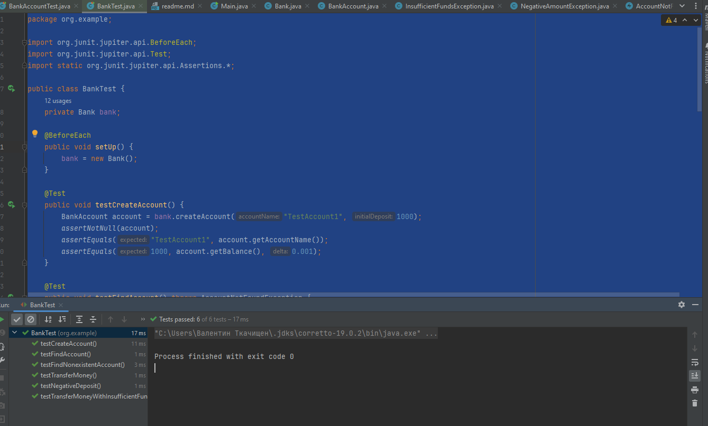

# Лабораторна робота 5
## виконав : студент групи ПД-32 Ткачищен Валентин
***
### План роботи:

1. Реалізувати клас BankAccount з членами класу accountNumber, accountName і balance.
2. Реалізувати методи deposit(double amount), withdraw(double amount), getBalance() та getAccountSummary().
3. Створити спеціалізовані класи винятків:
   - InsufficientFundsException
   - NegativeAmountException
   - AccountNotFoundException

4. Реалізуйте клас Bank, який зберігає колекцію об'єктів BankAccount.
5. У класі Bank, реалізуйте методи:
   - createAccount(String accountName, double initialDeposit)
   - findAccount(int accountNumber)
   - transferMoney(int fromAccountNumber, int toAccountNumber, double amount)
5. Обробляйте винятки відповідно в кожному методі.
6. Створіть тестові класи, де ви моделюєте різні сценарії для тестування обробки виняткових ситуацій.
***
### Хід розробки:

Вигляд класу `BankAccount`
```java
package org.example;

public class BankAccount {
   private int accountNumber;
   private String accountName;
   private double balance;

   public BankAccount(int accountNumber, String accountName, double initialDeposit) {
      this.accountNumber = accountNumber;
      this.accountName = accountName;
      this.balance = initialDeposit;
   }

   public void deposit(double amount) throws NegativeAmountException {
      if (amount < 0) {
         throw new NegativeAmountException("Amount for deposit cannot be negative.");
      }
      balance += amount;
   }

   public void withdraw(double amount) throws NegativeAmountException, InsufficientFundsException {
      if (amount < 0) {
         throw new NegativeAmountException("Amount for withdrawal cannot be negative.");
      }
      if (amount > balance) {
         throw new InsufficientFundsException("Insufficient funds for withdrawal.");
      }
      balance -= amount;
   }

   public double getBalance() {
      return balance;
   }

   public String getAccountSummary() {
      return "Account Number: " + accountNumber + ", Account Name: " + accountName + ", Balance: " + balance;
   }

   public int getAccountNumber() {
      return accountNumber;
   }

   public String getAccountName () {
      return accountName;
   }
}
```

Вигляд класу `Bank` :
```java
package org.example;

import java.util.ArrayList;
import java.util.List;

public class Bank {
   private List<BankAccount> accounts;

   public Bank() {
      this.accounts = new ArrayList<>();
   }

   public BankAccount createAccount(String accountName, double initialDeposit) {
      int accountNumber = generateAccountNumber();
      BankAccount account = new BankAccount(accountNumber, accountName, initialDeposit);
      accounts.add(account);
      return account;
   }

   public BankAccount findAccount(int accountNumber) throws AccountNotFoundException {
      for (BankAccount account : accounts) {
         if (account.getAccountNumber() == accountNumber) {
            return account;
         }
      }
      throw new AccountNotFoundException("Account with number " + accountNumber + " not found.");
   }

   public void transferMoney(int fromAccountNumber, int toAccountNumber, double amount)
           throws AccountNotFoundException, InsufficientFundsException, NegativeAmountException {
      BankAccount fromAccount = findAccount(fromAccountNumber);
      BankAccount toAccount = findAccount(toAccountNumber);

      fromAccount.withdraw(amount);
      toAccount.deposit(amount);
   }

   private int generateAccountNumber() {
      return accounts.size() + 1;
   }
}

```

Вигляд класів винятків :

- `InsufficientFundsException` :
```java
package org.example;

public class InsufficientFundsException extends Exception {
   public InsufficientFundsException(String message) {
      super(message);
   }
}
```

- `NegativeAmountException` :
```java
package org.example;

public class NegativeAmountException extends Exception {
   public NegativeAmountException(String message) {
      super(message);
   }
}
```

- `AccountNotFoundException` :
```java
package org.example;

public class AccountNotFoundException extends Exception {
   public AccountNotFoundException(String message) {
      super(message);
   }
}
```

Вигляд класу `Main`, цей клас був створений для запуску програми
```java
package org.example;

public class Main {
    public static void main(String[] args) {
        try {
            Bank bank = new Bank();

            BankAccount account1 = bank.createAccount("Client1", 2300);
            BankAccount account2 = bank.createAccount("Client2", 540);

            System.out.println(account1.getAccountSummary());
            System.out.println(account2.getAccountSummary());

            account1.withdraw(200);
            account2.deposit(200);

            System.out.println(account1.getAccountSummary());
            System.out.println(account2.getAccountSummary());

            bank.transferMoney(account1.getAccountNumber(), account2.getAccountNumber(), 300);

            System.out.println(account1.getAccountSummary());
            System.out.println(account2.getAccountSummary());

        } catch (NegativeAmountException | InsufficientFundsException | AccountNotFoundException e) {
            e.printStackTrace();
        }
    }
}


```


Тестові класи :
- `BankAccountTest` :
```java
package org.example;

import org.junit.jupiter.api.Test;
import static org.junit.jupiter.api.Assertions.*;

class BankAccountTest {

   @Test
   public void testDeposit() throws NegativeAmountException {
      BankAccount account = new BankAccount(1, "Account1", 0);
      account.deposit(100.0);
      assertEquals(100.0, account.getBalance(), 0.001);
   }

   @Test
   public void testWithdraw() throws InsufficientFundsException, NegativeAmountException {
      BankAccount account = new BankAccount(2, "Account2", 200.0);
      account.withdraw(50.0);
      assertEquals(150.0, account.getBalance(), 0.001);
   }
}

```
- `BankTest` :
```java
package org.example;

import org.junit.jupiter.api.BeforeEach;
import org.junit.jupiter.api.Test;
import static org.junit.jupiter.api.Assertions.*;

public class BankTest {
   private Bank bank;

   @BeforeEach
   public void setUp() {
      bank = new Bank();
   }

   @Test
   public void testCreateAccount() {
      BankAccount account = bank.createAccount("TestAccount1", 1000);
      assertNotNull(account);
      assertEquals("TestAccount1", account.getAccountName());
      assertEquals(1000, account.getBalance(), 0.001);
   }

   @Test
   public void testFindAccount() throws AccountNotFoundException {
      BankAccount account = bank.createAccount("TestAccount2", 500);
      int accountNumber = account.getAccountNumber();

      BankAccount foundAccount = bank.findAccount(accountNumber);
      assertNotNull(foundAccount);
      assertEquals(accountNumber, foundAccount.getAccountNumber());
      assertEquals("TestAccount2", foundAccount.getAccountName());
      assertEquals(500, foundAccount.getBalance(), 0.001);
   }

   @Test
   public void testTransferMoney() throws AccountNotFoundException, InsufficientFundsException, NegativeAmountException {
      BankAccount account1 = bank.createAccount("TestAccount1", 1000);
      BankAccount account2 = bank.createAccount("TestAccount2", 500);

      bank.transferMoney(account1.getAccountNumber(), account2.getAccountNumber(), 300);

      assertEquals(700, account1.getBalance(), 0.001);
      assertEquals(800, account2.getBalance(), 0.001);
   }

   @Test
   public void testTransferMoneyWithInsufficientFunds() throws AccountNotFoundException, InsufficientFundsException, NegativeAmountException {
      assertThrows(InsufficientFundsException.class, () -> {
         BankAccount account1 = bank.createAccount("TestAccount1", 100);
         BankAccount account2 = bank.createAccount("TestAccount2", 500);

         bank.transferMoney(account1.getAccountNumber(), account2.getAccountNumber(), 200); // Trying to transfer more than the balance of account1
      });
   }

   @Test
   public void testFindNonexistentAccount() {
      assertThrows(AccountNotFoundException.class, () -> {
         bank.findAccount(12345); // Assuming 12345 is a non-existent account number
      });
   }

   @Test
   public void testNegativeDeposit() throws NegativeAmountException {
      assertThrows(NegativeAmountException.class, () -> {
         BankAccount account = bank.createAccount("TestAccount1", 1000);
         account.deposit(-200); // Trying to deposit a negative amount
      });
   }
}
```
Тестування показало, що все працює належним чином.


pom.xml буде знаходитись в основній теці лабораторної роботи